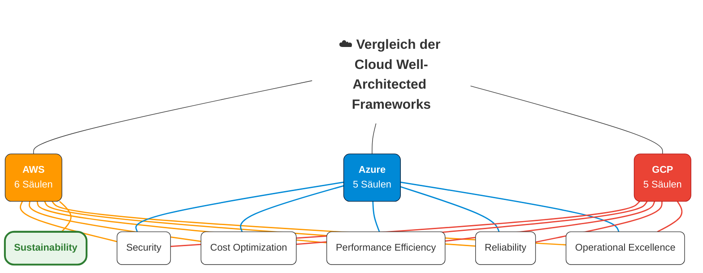
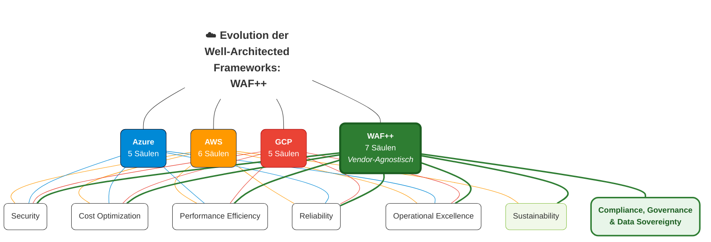

# Vergleich der Cloud Well-Architected Frameworks

```mermaid
graph TD
    %% Titel
    Title[<br>☁️ <b>Vergleich der Cloud Well-Architected Frameworks</b><br>]
    style Title fill:none,stroke:none,font-size:22px

    %% Provider-Knoten
    AWS(<b>AWS</b><br>6 Säulen)
    Azure(<b>Azure</b><br>5 Säulen)
    GCP(<b>GCP</b><br>5 Säulen)

    %% Säulen
    S1(Security)
    S2(Cost Optimization)
    S3(Performance Efficiency)
    S4(Reliability)
    S5(Operational Excellence)
    S6(<b>Sustainability</b>)

    %% Styling Knoten
    style AWS fill:#FF9900,stroke:#232F3E,color:#fff,rx:10,ry:10
    style Azure fill:#0089D6,stroke:#001731,color:#fff,rx:10,ry:10
    style GCP fill:#EA4335,stroke:#B21414,color:#fff,rx:10,ry:10
    
    style S1 fill:#fff,stroke:#333,rx:8,ry:8
    style S2 fill:#fff,stroke:#333,rx:8,ry:8
    style S3 fill:#fff,stroke:#333,rx:8,ry:8
    style S4 fill:#fff,stroke:#333,rx:8,ry:8
    style S5 fill:#fff,stroke:#333,rx:8,ry:8
    style S6 fill:#e8f5e9,stroke:#2e7d32,stroke-width:3px,color:#2e7d32,rx:15,ry:15

    %% Verbindungen (Reihenfolge ist wichtig für linkStyle!)
    Title --- AWS
    Title --- Azure
    Title --- GCP

    %% AWS (Indizes 3 bis 8)
    AWS --- S1
    AWS --- S2
    AWS --- S3
    AWS --- S4
    AWS --- S5
    AWS --- S6

    %% Azure (Indizes 9 bis 13)
    Azure --- S1
    Azure --- S2
    Azure --- S3
    Azure --- S4
    Azure --- S5

    %% GCP (Indizes 14 bis 18)
    GCP --- S1
    GCP --- S2
    GCP --- S3
    GCP --- S4
    GCP --- S5

    %% Link Styling (Farbige Linien)
    linkStyle 3,4,5,6,7,8 stroke:#FF9900,stroke-width:2px
    linkStyle 9,10,11,12,13 stroke:#0089D6,stroke-width:2px
    linkStyle 14,15,16,17,18 stroke:#EA4335,stroke-width:2px
```

# Evolution der Well-Architected Frameworks: WAF++

```mermaid
graph TD
    %% Titel
    Title[<br>☁️ <b>Evolution der Well-Architected Frameworks: WAF++</b><br>]
    style Title fill:none,stroke:none,font-size:22px

    %% Provider-Knoten
    AWS(<b>AWS</b><br>6 Säulen)
    Azure(<b>Azure</b><br>5 Säulen)
    GCP(<b>GCP</b><br>5 Säulen)
    WAFPP(<b>WAF++</b><br>7 Säulen<br><i>Vendor-Agnostisch</i>)

    %% Säulen
    S1(Security)
    S2(Cost Optimization)
    S3(Performance Efficiency)
    S4(Reliability)
    S5(Operational Excellence)
    S6(Sustainability)
    S7(<b>Compliance, Governance<br>& Data Sovereignty</b>)

    %% Styling Provider
    style AWS fill:#FF9900,stroke:#232F3E,color:#fff,rx:10,ry:10
    style Azure fill:#0089D6,stroke:#001731,color:#fff,rx:10,ry:10
    style GCP fill:#EA4335,stroke:#B21414,color:#fff,rx:10,ry:10
    style WAFPP fill:#2E7D32,stroke:#1B5E20,color:#fff,stroke-width:4px,rx:10,ry:10
    
    %% Styling Säulen
    style S1 fill:#fff,stroke:#333,rx:8,ry:8
    style S2 fill:#fff,stroke:#333,rx:8,ry:8
    style S3 fill:#fff,stroke:#333,rx:8,ry:8
    style S4 fill:#fff,stroke:#333,rx:8,ry:8
    style S5 fill:#fff,stroke:#333,rx:8,ry:8
    style S6 fill:#f1f8e9,stroke:#8bc34a,rx:8,ry:8
    style S7 fill:#E8F5E9,stroke:#2E7D32,stroke-width:3px,color:#1B5E20,rx:15,ry:15

    %% Verbindungen
    Title --- AWS & Azure & GCP & WAFPP

    %% AWS Pfeile (Orange)
    AWS --- S1
    AWS --- S2
    AWS --- S3
    AWS --- S4
    AWS --- S5
    AWS --- S6
    linkStyle 4,5,6,7,8,9 stroke:#FF9900,stroke-width:1px

    %% Azure Pfeile (Blau)
    Azure --- S1
    Azure --- S2
    Azure --- S3
    Azure --- S4
    Azure --- S5
    linkStyle 10,11,12,13,14 stroke:#0089D6,stroke-width:1px

    %% GCP Pfeile (Rot)
    GCP --- S1
    GCP --- S2
    GCP --- S3
    GCP --- S4
    GCP --- S5
    linkStyle 15,16,17,18,19 stroke:#EA4335,stroke-width:1px

    %% WAF++ Pfeile (Grün - Hervorgehoben)
    WAFPP --- S1
    WAFPP --- S2
    WAFPP --- S3
    WAFPP --- S4
    WAFPP --- S5
    WAFPP --- S6
    WAFPP --- S7
    linkStyle 20,21,22,23,24,25,26 stroke:#2E7D32,stroke-width:3px
```